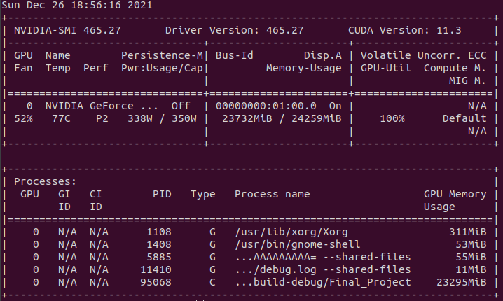
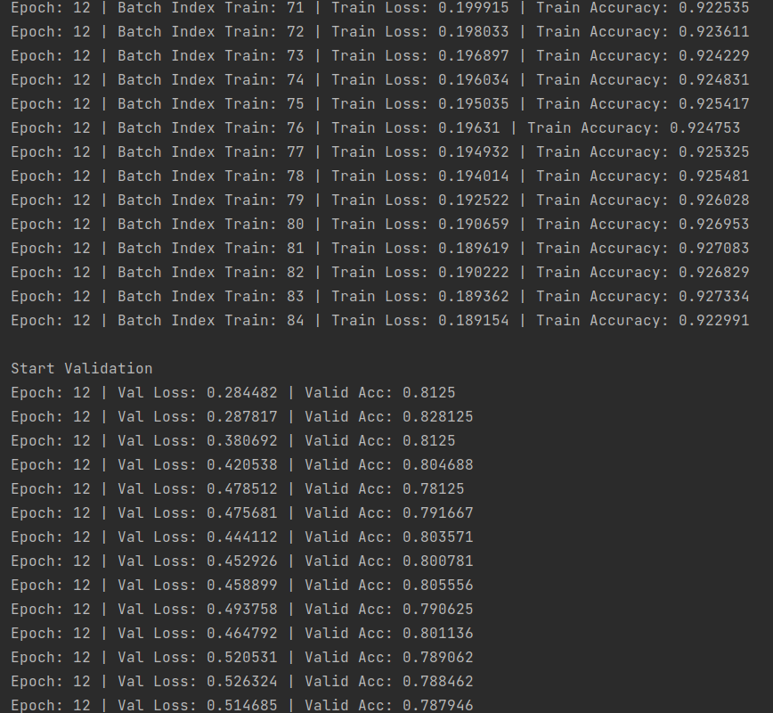
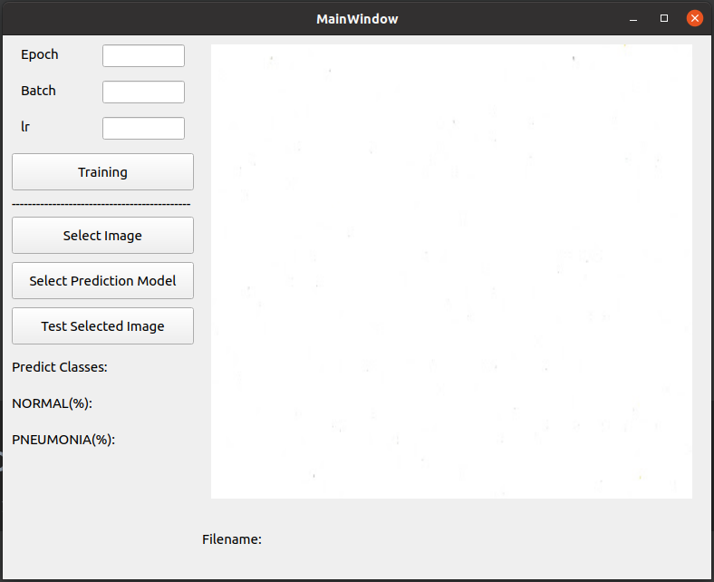
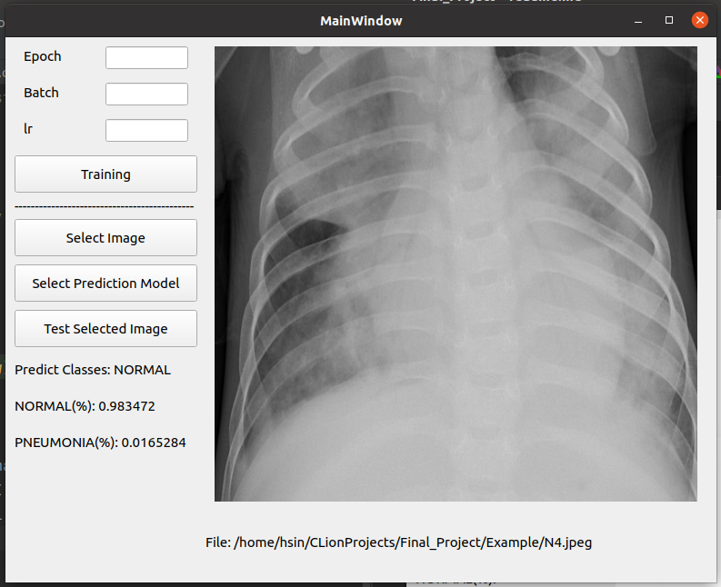
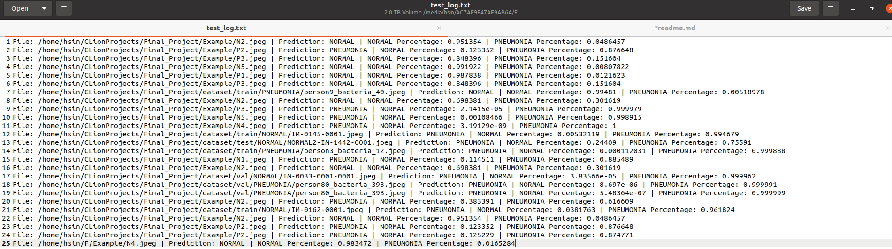

# Medical Classification
****
## Computer Hardware
* CPU: Intel i9-10900K
* RAM: 64GB
* GPU: Nvidia RTX 3090 24GB

## Enviornment
* Operating System: Linux Ubuntu 20.04
* G++ versions: Ubuntu 9.3.0
* IDLE: Jet Brains Clion 2021.3
* Libraries: Please Link all library by CMake
  * QT == 5.12.0
  * libtorch == 1.10
  * opencv == 4.4.0
* CMake: 3.16
* NVIDIA-SMI == 465.27
* CUDA == 11.3
* Cudnn == 8.2.2

## Dataset 
https://www.kaggle.com/paultimothymooney/chest-xray-pneumonia

This Dataset has approximately 6000 images, and split all dataset into training set, validation set and test set

## Training
* Use GPU
   


* Training Example Image


## Folder Structure
```asm
├── cmake-build-debug
│   ├── CMakeFiles
│   │   ├── 3.21.1
│   │   │   ├── CompilerIdC
│   │   │   │   └── tmp
│   │   │   └── CompilerIdCXX
│   │   │       └── tmp
│   │   ├── CMakeTmp
│   │   └── Final_Project.dir
│   └── Testing
│       └── Temporary
└── dataset
    ├── test
    │   ├── NORMAL
    │   └── PNEUMONIA
    ├── train
    │   ├── NORMAL
    │   └── PNEUMONIA
    └── val
        ├── NORMAL
        └── PNEUMONIA
```

## Demo
If you don't use CLion as your IDLE, 
you can compile this project by your commander

```cmd=
## Modify your library path in CMakeLists.txt first
cd {Your Project Path}
mkdir build && cd build
cmake ..
makecp
cp ./Final_Project ../ && cd ../
./Final_Project
```

Demo for compile successful



### Test and Record

* If you want to predict your image, you can choose the model for you first
* If you don't want to choose, I write the default model
* If you want to train the model, I write the training function for you and you don't need to worry about the save model


* Record
